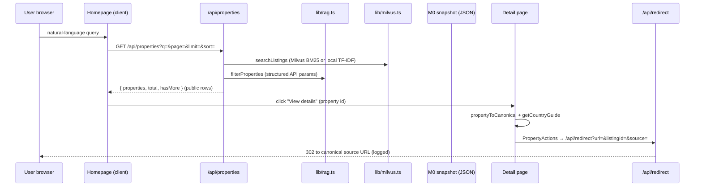

# Architecture Overview

Homes in the Sun is a **Next.js 14 (App Router) + React 18** application deployed to Vercel (see `vercel.json`: `framework: nextjs`, API routes capped at 30s max duration). There is no ChromaDB process: structured NL intent stays local, and rank/retrieve of the full listing corpus runs in Zilliz/Milvus (BM25) when configured, else a compact TF-IDF fallback.

The architecture is deliberately small and "serverless-friendly":

- `rag/properties_data.json` — full M0 hydration snapshot (~11,960 listings; `properties_data.full.json` is the gitignored local copy of the same dump).
- `lib/milvus.ts` — REST client to Zilliz (`ZILLIZ_URI` + `ZILLIZ_TOKEN`); BM25 search, no embedding model on Vercel.
- `rag/vector-index.json` — sparse TF-IDF fallback used when Milvus env is missing (`npm test`).
- `lib/rag.ts` — TypeScript comparators (`parseSearchIntent`, `intentToWhere`, `intentToMilvusExpr`, AND-gate) plus local `searchProperties`.
- `lib/canonical.ts` — the thin referral schema (`CanonicalListing`) that UI and APIs must use; source-specific fields live only in adapters.
- `lib/sources/yoh-snapshot.ts` — the M0 adapter mapping legacy `Property` rows into `CanonicalListing`.
- `app/` — server-rendered pages (homepage, `properties/[id]`, `guides/[country]`) plus API routes.
- `components/` — client components (PropertyCard, PropertyActions, CountryGuidePanel, LeadForm, Footer, BrandLogo).

## Runtime flow (request → search → outbound)

Key design choices visible in this flow:

- **Search is async at the API boundary**: `/api/properties` and `/api/search` await `searchListings`. Comparators stay in `lib/rag.ts`. When `ZILLIZ_TOKEN` is unset, search falls back to in-process TF-IDF.
- **`/api/properties` is the workhorse**: it handles `id` lookup, structured filters, text search, server-side sorting (`best`/`price-asc`/`price-desc`/`newest`), and pagination over the **full** matched set so totals and ordering stay consistent across pages (fixed by commit `93ff183` and `3313b5e`).
- **Public rows are thin**: `toPublicProperties()` maps each row through the canonical adapter and replaces the fat description with a 220-char snippet plus absolute canonical URL (`lib/public-listing.ts`). The detail page shows only this teaser, per the referral posture in [Business Model and Data Rights](/openwiki/architecture/business-model.md).
- **Outbound is the "done" path**: the primary CTA is `View full listing on <source>` through `/api/redirect`, which validates the target, appends a click log line, and 302-redirects. See [Redirects and Leads](/openwiki/workflows/redirects-and-leads.md).

## Layout and routing

| Route | Kind | Responsibility |
|---|---|---|
| `/` | RSC + client (`app/page.tsx`) | Search UI, sort, pagination, FAQ, waitlist form |
| `/properties/[id]` | Server page | Thin detail teaser + country guide panel + intro request |
| `/guides/[country]` | Static-generated page | Full country guide (`generateStaticParams` from guide files) |
| `/api/properties` | Route handler | Listing search/filter/sort/paginate + `id` lookup |
| `/api/search` | Route handler | Minimal top-20 NL search (used by the buyer-agent `search` contract) |
| `/api/guides/[country]` | Route handler | Guide JSON (`get_country_guide` contract) |
| `/api/redirect` | Route handler | Validated 302 outbound click |
| `/api/leads` | Route handler | Waitlist / request-intro capture |

The API contract surface is documented in [API Surface](/openwiki/workflows/api-surface.md); the underlying data model in [Search and Data](/openwiki/architecture/search-and-data.md).

## Why this shape exists (git evidence)

- Commit `0592612` established the scaffold, spec, and tickets; `3444c73` made the Next.js dev server work.
- `065b144` implemented the original search (API routes, PropertyCard, homepage, detail).
- `b00139e` added natural-language intent parsing (price/location/feature/bedroom) with a test suite; `53e320b` corrected multi-term search to AND-logic (intersection); `8d1b462` and `ff72b6e` refined price-intent parsing; `f0b28fc` fixed bedroom filtering to exact-match.
- `bba3081` applied the "Homes in the Sun" redesign handoff (rebrand + restyle); `9e2613c` was the preceding Airbnb-style UI branch (`airbnb-ui`), merged into the MVP base.
- `8d4339f` (HEAD) shipped **MVP-1**: country guides (Spain), leads, outbound redirects, canonical schema, and agent-ops docs — the current wiki reflects this state.

## Change guidance for agents

- **Search behavior changes** live in `lib/rag.ts` and its tests; always run `npm test` and the golden-query eval (`scripts/agent/run_search_evals.py`) when touching intent parsing.
- **Never add site-specific fields to UI** — map them in an adapter (`lib/sources/`) into `CanonicalListing` (policy: `docs/agent-ops/policies/engineering.md`).
- **Index replacements are draft-first**: replacing `rag/properties_data.json` or enabling M1 ingest requires Bob approval per `docs/agent-ops/policies/deploy-and-data.md`.
- **UI/search changes** need the Playwright suite (`npx playwright test`) and `scripts/agent/site_healthcheck.sh` after deploy.
