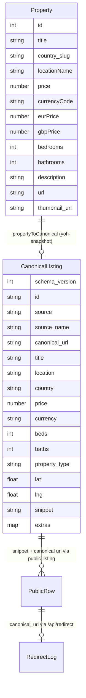
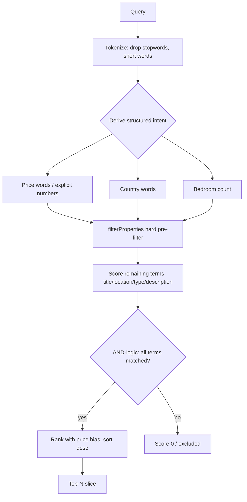

# Search and Data

This page covers the data model and the search engine behind Homes in the Sun. It is the canonical home for the `Property` ↔ `CanonicalListing` mapping and the NL search rules.

## Data sources and index modes

The repository supports four ingest modes, but the MVP ships only **M0** (frozen snapshot):

| Mode | Meaning | MVP status |
|---|---|---|
| M0 | Frozen snapshot (`rag/properties_data.json` via `lib/sources/yoh-snapshot.ts`) | **Current** |
| M1 | Allowlisted agent thin crawl | Escalate before enabling |
| M2 | Partner/licensed feed | Preferred end-state (Roccabox pilot planned) |
| M3 | Fat mega-portal rescrape (YOH API mirror, Rightmove bulk) | **Forbidden** |

The full ingest-mode policy is documented in [Business Model and Data Rights](business-model.md). The adapter pipeline is:

```text
Site HTML/API → source adapter → CanonicalListing → search / cards / APIs
```

`lib/sources/README.md` records the adapter inventory: `yoh-snapshot.ts` (M0, shipped) and `roccabox.ts` (planned M1/M2 — blocked on BD/allowlist approval). Expanding supply means **adding adapters**, not redesigning `lib/rag.ts`.

## Data model

### Legacy `Property` row (`lib/rag.ts`)

The frozen snapshot rows carry fat legacy fields: `description` (full body), `eurPrice`/`gbpPrice`, `plotSize`/`buildSize`, `latitude`/`longitude`, `url` (relative source path), `image_count`, `thumbnail_url`, optional `tag`, and derived `hasPool` on public rows.

### Canonical `CanonicalListing` (`lib/canonical.ts`)

The **thin referral schema** (Level A/B) that UI and APIs must consume. Required fields: `id`, `source`, `canonical_url` (absolute http(s)), `title`, `price`, `currency`. Optional: `beds`, `baths`, `property_type`, `lat`/`lng`, `ref`, `thumbnail_url`, `snippet` (short teaser), `extras`. `assertCanonical()` validates a listing; `SCHEMA_VERSION = 1` is frozen.

The schema exists so that **search/UI never depend on site-specific fields** — source adapters map into it, and `assertCanonical` guards the contract (tested in `lib/canonical.test.ts`).



### Adapter: `propertyToCanonical` (`lib/sources/yoh-snapshot.ts`)

Maps a legacy `Property` into `CanonicalListing`:

- `canonical_url` via `toAbsoluteCanonicalUrl(p.url, YOH_ORIGIN)` — relative snapshot paths get prefixed with `https://www.youroverseashome.com` (`lib/urls.ts`).
- `property_type` inferred from the title with a local `inferType` (villa/apartment/townhouse/house/land/property).
- `snippet` = first 220 chars of the description.
- `extras` carries `eurPrice`, `gbpPrice`, `buildSize`, `plotSize`, `image_count`, `legacy_url`, and `hasPool` (regex-detected from the description).
- Validation failures are **soft** (recorded in `extras.canonical_errors`) so demo data still renders.

## Search engine (`lib/rag.ts`)

A TypeScript port of the original `rag_pipeline.py`, designed to run **without ChromaDB** on Vercel (the chroma_db was 101MB — too heavy for serverless). Search is a three-stage pipeline:

### 1. Structured filter derivation (intent → hard pre-filter)

Query terms are classified into hard filters before scoring:

- **Price intent words**: `cheap`/`affordable`/`budget`/`inexpensive` → `maxPrice: 250000`; `luxury`/`expensive`/`premium`/`high-end` → `minPrice: 1000000`.
- **Country words** → `country_slug` (spain/france/portugal/italy/cyprus/malta/greece/switzerland/usa). At most one country per query.
- **Bedroom count**: `(\d+)\s*(?:-|–|—)?\s*(?:bed|bedroom|bedrooms|br)\b` → **exact** `beds` (not 3+) — fixed in commit `f0b28fc`.
- **Explicit price numbers** (`€300,000`, `300k`, `1.2m`, `1.5 million`): `under`/`below`/`less` → `maxPrice`; `over`/`above`/`more` → `minPrice`; no direction word → soft ±20% proximity band.

### 2. Text scoring

Each remaining term scores against title (+10), location (+8), property type (+6), description (+2), and numeric price tokens (+5). Terms are handled via stopwords, generic dwelling nouns (`house`, `home`, `flat`, … match any type), and specific type nouns (villa/apartment/…) which act as hard requirements.

### 3. AND-logic + ranking

- **AND-logic**: a result must contain **every** meaningful scoring term (intersection, not union) — fixed in commit `53e320b` and enforced by tests.
- **Price ordering**: when `maxPrice` intent exists, score is boosted by `(maxPrice - price)/1000` (cheapest first); `minPrice` intent boosts pricier-first.
- The scored list is sorted descending and sliced to the limit; `getPropertyById` returns a single row for detail pages.



## Public surface: thin rows (`lib/public-listing.ts`)

`toPublicProperty` maps a row through `propertyToCanonical` and returns a **thin** `Property`: absolute canonical `url`, description replaced by the snippet, `hasPool` surfaced. `getPublicPropertyById` is used by `/api/properties?id=`; the detail page in [API Surface](/openwiki/workflows/api-surface.md) does the same mapping server-side.

## Why this design exists

- The frozen snapshot keeps search deterministic and zero-cost to host; the module cache avoids re-parsing 12MB of JSON per request.
- The canonical schema decouples supply growth (new adapters) from the UI/search layer — expanding pilots = **new adapters**, not redesigns (documented in `docs/mvp/scraping-and-referral.md`).
- NL intent is applied as hard pre-filters rather than text, so "cheap" actually moves results toward low prices and "spain" filters by country instead of matching substrings.

## Change guidance

- **Intent parsing changes** (price/country/bedroom/AND-logic) must keep `lib/rag.test.ts` green — it is the regression net for every search rule; golden queries in `docs/agent-ops/golden-queries.json` add end-to-end coverage via `scripts/agent/run_search_evals.py` (see [Agent Ops](/openwiki/operations/agent-ops.md)).
- **New source adapters**: add `lib/sources/<name>.ts` mapping into `CanonicalListing`; do not leak source-specific fields into components (policy: `docs/agent-ops/policies/engineering.md`).
- **Corpus changes** (replacing `rag/properties_data.json`) are draft-first per `docs/agent-ops/policies/deploy-and-data.md`; `scripts/agent/corpus_stats.py` reports mtime/count/country histogram for governance.
- The current corpus distribution (from `rag/properties_data.json` header): spain 7,787 · cyprus 1,478 · portugal 1,060 · france 692 · italy 558 · usa 184 · malta 76 · switzerland 70 · greece 55 (total 11,960).
