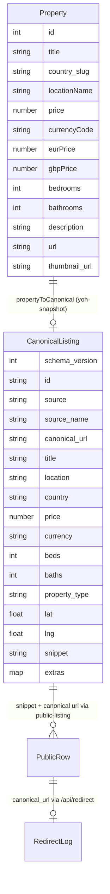
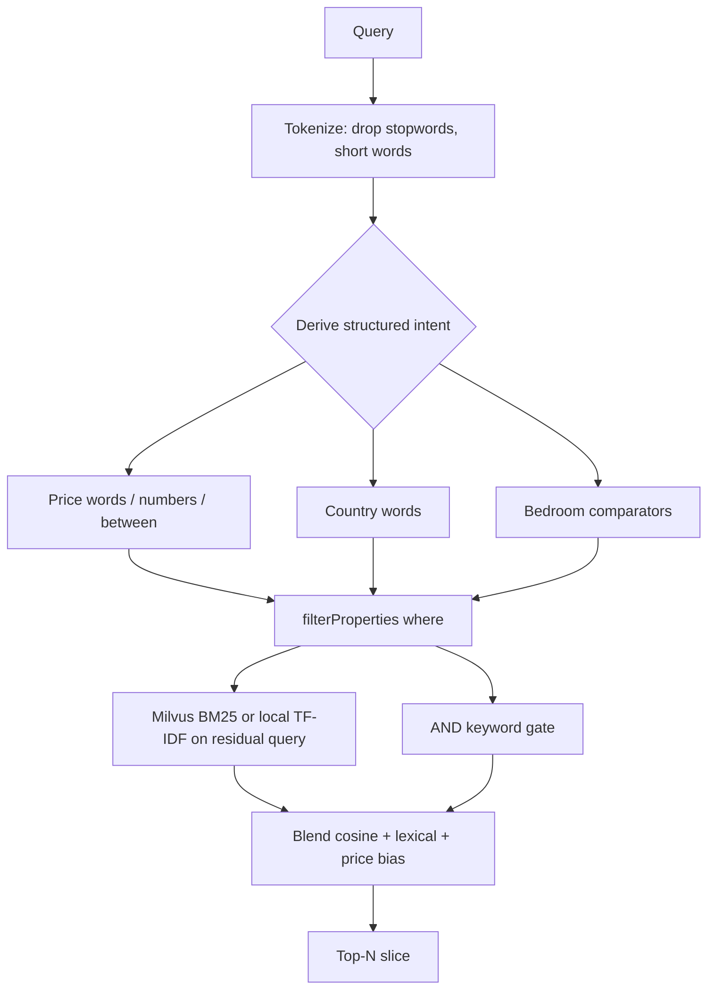

# Search and Data

This page covers the data model and the search engine behind Homes in the Sun. It is the canonical home for the `Property` ↔ `CanonicalListing` mapping and the NL search rules.

## Data sources and index modes

The repository supports four ingest modes, but the MVP ships only **M0** (frozen snapshot):

| Mode | Meaning | MVP status |
|---|---|---|
| M0 | Frozen snapshot (`rag/properties_data.json` via `lib/sources/yoh-snapshot.ts`) | **Current** |
| M1 | Allowlisted agent thin crawl | Escalate before enabling |
| M2 | Partner/licensed feed | Preferred end-state (Roccabox pilot planned) |
| M3 | Fat mega-portal rescrape (YOH API mirror, Rightmove bulk) | **Forbidden** |

The full ingest-mode policy is documented in [Business Model and Data Rights](business-model.md). The adapter pipeline is:

```text
Site HTML/API → source adapter → CanonicalListing → search / cards / APIs
```

`lib/sources/README.md` records the adapter inventory: `yoh-snapshot.ts` (M0, shipped) and `roccabox.ts` (planned M1/M2 — blocked on BD/allowlist approval). Expanding supply means **adding adapters**, not redesigning `lib/rag.ts`.

## Data model

### Legacy `Property` row (`lib/rag.ts`)

The frozen snapshot rows carry fat legacy fields: `description` (full body), `eurPrice`/`gbpPrice`, `plotSize`/`buildSize`, `latitude`/`longitude`, `url` (relative source path), `image_count`, `thumbnail_url`, optional `tag`, and derived `hasPool` on public rows.

### Canonical `CanonicalListing` (`lib/canonical.ts`)

The **thin referral schema** (Level A/B) that UI and APIs must consume. Required fields: `id`, `source`, `canonical_url` (absolute http(s)), `title`, `price`, `currency`. Optional: `beds`, `baths`, `property_type`, `lat`/`lng`, `ref`, `thumbnail_url`, `snippet` (short teaser), `extras`. `assertCanonical()` validates a listing; `SCHEMA_VERSION = 1` is frozen.

The schema exists so that **search/UI never depend on site-specific fields** — source adapters map into it, and `assertCanonical` guards the contract (tested in `lib/canonical.test.ts`).



### Adapter: `propertyToCanonical` (`lib/sources/yoh-snapshot.ts`)

Maps a legacy `Property` into `CanonicalListing`:

- `canonical_url` via `toAbsoluteCanonicalUrl(p.url, YOH_ORIGIN)` — relative snapshot paths get prefixed with `https://www.youroverseashome.com` (`lib/urls.ts`).
- `property_type` inferred from the title with a local `inferType` (villa/apartment/townhouse/house/land/property).
- `snippet` = first 220 chars of the description.
- `extras` carries `eurPrice`, `gbpPrice`, `buildSize`, `plotSize`, `image_count`, `legacy_url`, and `hasPool` (regex-detected from the description).
- Validation failures are **soft** (recorded in `extras.canonical_errors`) so demo data still renders.

## Search engine (`lib/rag.ts` + `lib/milvus.ts`)

NL comparators stay local (`parseSearchIntent` → `intentToWhere` / `intentToMilvusExpr` / AND-gate). Rank/retrieve of the **full ~11,960 listing corpus** runs in Zilliz/Milvus when `ZILLIZ_TOKEN` is set; otherwise search falls back to in-process TF-IDF so CI stays offline.

1. **Metadata `where`** — `parseSearchIntent` → `intentToMilvusExpr` (Milvus scalar filter on `price`, `bedrooms`, `country`) and `filterProperties` (local safety net).
2. **Vector rank** — residual query text is sent to Zilliz as BM25 (no MiniLM/OpenAI/Chroma weights on Vercel). Offline fallback encodes the same residual against `rag/vector-index.json`.
3. **AND-logic** still gates leftover keywords after hydration so "valencia" cannot drift to a neighbouring town.

Listing **hydration** uses the full M0 snapshot (`rag/properties_data.full.json` if present, else `rag/properties_data.json`). Rebuild/ingest with `python3 scripts/rag/shed_and_embed.py`.

Live Zilliz ingest (skipped when the token is missing). The script loads repo-root `.env.local` first:

```bash
pip install pymilvus
python3 scripts/rag/shed_and_embed.py
# or: npm run embed
```

Optional: `ZILLIZ_COLLECTION` (default `listings`). Never commit the token.

### 1. Structured filter derivation (intent → hard pre-filter)

Query terms are classified into hard filters before scoring:

- **Price intent words**: `cheap`/`affordable`/`budget`/`inexpensive` → `maxPrice: 250000`; `luxury`/`expensive`/`premium`/`high-end` → `minPrice: 1000000`.
- **Country words** → `country_slug` (spain/france/portugal/italy/cyprus/malta/greece/switzerland/usa). At most one country per query.
- **Bedroom count** (parsed before prices so `4` in `less than 4 bedrooms` is not €4):
  - Bare `N bed` / `N-bed` / `Nbr` → **exact** `beds` (not 3+).
  - `at least N` / `N+` / `N or more` → `minBeds`.
  - `less than N` / `fewer than N` → `maxBeds = N-1` (exclusive).
  - `under` / `up to` / `no more than N` → `maxBeds = N` (inclusive).
  - `between N and M bedrooms` → inclusive `minBeds`/`maxBeds`.
- **Explicit price numbers** (`€300,000`, `300k`, `1.2m`, `1.5 million`):
  - `under`/`below`/`less than` → `maxPrice` (inclusive).
  - `over`/`above`/`more than` → `minPrice`.
  - `between A and B` / `from A to B` / `A–B` → inclusive `minPrice`+`maxPrice`.
  - No direction word → soft ±20% proximity band.
  - Comparator tokens (`than`, `between`, …) are consumed so AND-scoring does not require them in listing text.

### 2. Vector rank + lexical AND

When Zilliz is configured, residual terms are BM25-searched on the cluster (`lib/milvus.ts`) and hits are hydrated from the local snapshot. Offline, residual terms are encoded with the TF-IDF vocabulary in `rag/vector-index.json` and cosine-ranked. AND-logic still requires every leftover keyword in title/location/type/description. Generic dwelling nouns (`house`, `home`, …) do not gate AND.

### 3. Blend + slice

Final score = lexical weights + cosine×40 + cheap/luxury price bias. Sorted descending, sliced to `limit`.



## Public surface: thin rows (`lib/public-listing.ts`)

`toPublicProperty` maps a row through `propertyToCanonical` and returns a **thin** `Property`: absolute canonical `url`, description replaced by the snippet, `hasPool` surfaced. `getPublicPropertyById` is used by `/api/properties?id=`; the detail page in [API Surface](/openwiki/workflows/api-surface.md) does the same mapping server-side.

## Why this design exists

- The frozen snapshot hydrates listing bodies; Zilliz holds vectors + scalar filters for the full corpus. `npm test` uses the local TF-IDF fallback when `ZILLIZ_TOKEN` is unset.
- The canonical schema decouples supply growth (new adapters) from the UI/search layer — expanding pilots = **new adapters**, not redesigns (documented in `docs/mvp/scraping-and-referral.md`).
- NL intent is applied as hard pre-filters rather than text, so "cheap" actually moves results toward low prices and "spain" filters by country instead of matching substrings.

## Change guidance

- **Intent parsing changes** (price/country/bedroom/AND-logic) must keep `lib/rag.test.ts` green — it is the regression net for every search rule; golden queries in `docs/agent-ops/golden-queries.json` add end-to-end coverage via `scripts/agent/run_search_evals.py` (see [Agent Ops](/openwiki/operations/agent-ops.md)).
- **New source adapters**: add `lib/sources/<name>.ts` mapping into `CanonicalListing`; do not leak source-specific fields into components (policy: `docs/agent-ops/policies/engineering.md`).
- **Corpus changes** (replacing `rag/properties_data.json`) are draft-first per `docs/agent-ops/policies/deploy-and-data.md`; `scripts/agent/corpus_stats.py` reports mtime/count/country histogram for governance.
- The current search source of truth is **Zilliz/Milvus** over the full M0 snapshot (~11,960 listings). Local TF-IDF is the offline fallback. Rebuild/ingest via `scripts/rag/shed_and_embed.py`.
