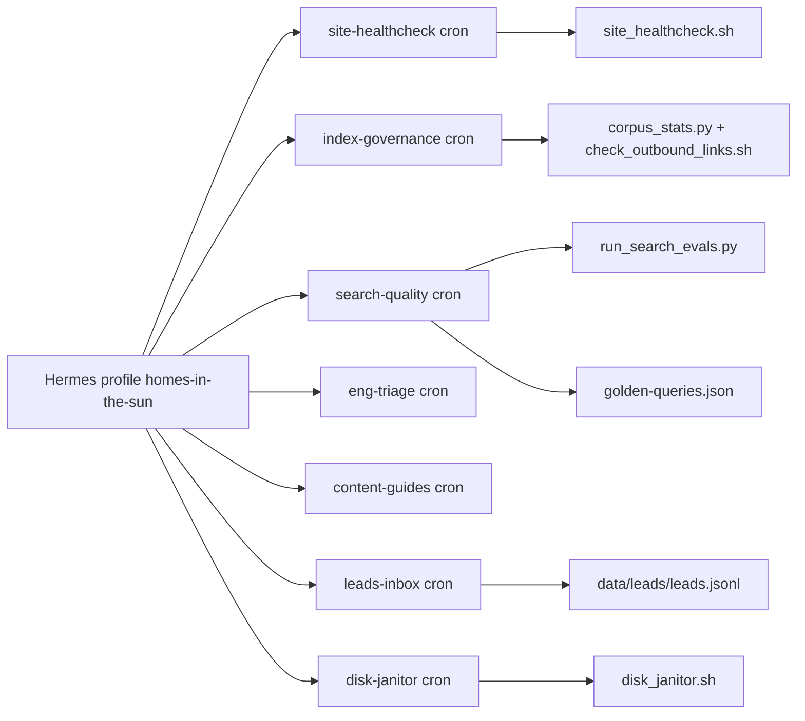

# Agent Ops

Homes in the Sun is **AI-operated**: a Hermes profile named `homes-in-the-sun` runs day-to-day operations (index health, search quality, engineering triage, content, leads, disk cleanup). Gumclaw's public write-up is the *inspiration* for the ops discipline (memory, cron, permission tiers, skills) — this is **not** a Gumroad clone, per `docs/agent-ops/SOUL.md` and `docs/mvp/README.md`.

## Operator identity

- **SOUL** (`docs/agent-ops/SOUL.md`): operate the aggregator — help buyers discover listings, then redirect them to the source estate agent; maintain thin index integrity, search quality, country guides, site reliability; report to **Bob** (Telegram); never invent listings, claim false partnerships, fat-rescrape mega-portals, or give personalised legal/tax advice.

## Permission tiers

Policies define three tiers — **autonomous / draft-first / escalate** (`docs/agent-ops/README.md`):

| Tier | Meaning | Example |
|---|---|---|
| Autonomous | Run without approval | Store waitlist leads; run healthchecks |
| Draft-first | Prepare, get Bob approval, then publish | Prod deploys changing search/index; guide updates; request-intro partner emails |
| Escalate | Human decision required | M1 allowlisted crawl; M3 rescrape; Phase-2 lead forwarding; partnerships |

## Recurring jobs (Hermes crons)

| Cron | Schedule | Job doc | Runs |
|---|---|---|---|
| `homes-site-healthcheck` | `*/30 * * * *` | [site-reliability.md](https://github.com/ojwiya/website-rag-search-poc/blob/mvp-1/docs/agent-ops/jobs/site-reliability.md) | `scripts/agent/site_healthcheck.sh` (no-agent) |
| `homes-index-governance` | `0 8 * * *` | [listing-pipeline.md](https://github.com/ojwiya/website-rag-search-poc/blob/mvp-1/docs/agent-ops/jobs/listing-pipeline.md) | corpus stats, outbound link sample |
| `homes-search-quality` | `0 9 * * *` | [search-quality.md](https://github.com/ojwiya/website-rag-search-poc/blob/mvp-1/docs/agent-ops/jobs/search-quality.md) | golden-query evals |
| `homes-eng-triage` | `0 10 * * 1-5` | [engineering-loop.md](https://github.com/ojwiya/website-rag-search-poc/blob/mvp-1/docs/agent-ops/jobs/engineering-loop.md) | issue triage → shippable fix on `mvp-1` |
| `homes-content-guides` | `0 11 * * 1` | [public-content.md](https://github.com/ojwiya/website-rag-search-poc/blob/mvp-1/docs/agent-ops/jobs/public-content.md) | guide freshness, draft-first updates |
| `homes-leads-inbox` | `0 12 * * *` | [leads-inbox.md](https://github.com/ojwiya/website-rag-search-poc/blob/mvp-1/docs/agent-ops/jobs/leads-inbox.md) | summarize `data/leads/leads.jsonl` |
| `homes-disk-janitor` | `0 7 * * 0` | (script) | `scripts/agent/disk_janitor.sh` (no-agent) |

Crons deliver locally by default; start the profile gateway to fire them: `hermes -p homes-in-the-sun gateway start` (or install). Scripts are also copied under the profile `scripts/` for cron `--script`.

## Agent scripts (`scripts/agent/`)

| Script | Purpose |
|---|---|
| `site_healthcheck.sh` | Smoke `/`, `/api/search?q=villa`, `/api/properties?limit=1`, `/api/guides/spain`, `/guides/spain` (default `BASE_URL=http://127.0.0.1:3000`) |
| `corpus_stats.py` | Report M0 corpus mtime, count, country histogram (index governance) |
| `run_search_evals.py` | Run golden NL queries against a running server; exits 1 on any FAIL |
| `check_outbound_links.sh` | Sample absolute canonical URLs from the snapshot and HEAD/GET-check them |
| `disk_janitor.sh` | Clear Playwright artifacts; deliberately **not** `.next` (per HANDOFF) |

The Hermes crons → scripts relationship:

## Golden queries (`docs/agent-ops/golden-queries.json`)

The NL-search regression set shared between Vitest and the eval script:

- `and-villa-pool-costa` — "Villa with pool, Costa del Sol" (country hint spain, 1..2000 results)
- `exact-3-bed-italy` — "3-bed villa with pool in Italy" (exact 3 beds, 1..500 results)
- `2br-apartment` — "2br apartment" (exact 2 beds, ≥100 results)
- `under-300k` — "apartment under €300,000" (maxPrice 300,000)

`run_search_evals.py` checks `minTotal`/`maxTotal`/`maxPrice`/`beds` expectations against `/api/properties` and prints PASS/FAIL per query. The same expectations are encoded in [Testing Overview](/openwiki/testing/overview.md) via `lib/rag.test.ts`.

## Policies

| Policy | Guardrail |
|---|---|
| `data-and-ip.md` | M0 allowed; M1 escalate; M2 preferred; M3 forbidden without written Bob approval; public surfaces stay thin |
| `grounded-claims.md` | Verify counts/prices with scripts before stating; cite guide tax facts checked same session; never claim "Agent-verified" or fake partnerships |
| `reply-and-leads.md` | Waitlist autonomous; request-intro stored only, no auto-forward; Phase-2 escalate until commercials.md marks it live |
| `deploy-and-data.md` | Search/index-shape prod deploys draft-first; corpus replacement draft-first; post-deploy Playwright + healthcheck |
| `engineering.md` | Worktree on `mvp-1`; acceptance = `npm test`, `npm run build`, Playwright; no source-specific fields in UI |

The full text of each policy lives in [Business Model and Data Rights](/openwiki/architecture/business-model.md) context and under `docs/agent-ops/policies/`.

## Change guidance

- **Search quality regressions**: fix intent parsing in `lib/rag.ts`, not by swapping in freshly scraped fat rows (search-quality job rule). Keep golden queries and Vitest aligned.
- **Ops scripts** are invoked by crons — changing flags/outputs must be coordinated with the job docs under `docs/agent-ops/jobs/`.
- Runtime ledgers live in the Hermes profile memories (not git); local MVP ledgers are `data/redirects.jsonl` and `data/leads/leads.jsonl`.
