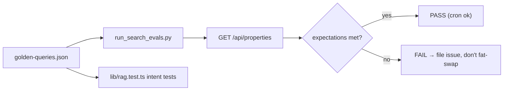

# Testing Overview

Homes in the Sun uses three complementary test layers: **Vitest** unit/integration tests for search and canonical logic, a **Playwright** end-to-end suite for the UI, and a **golden-query eval harness** for search quality that doubles as an agent-ops cron. The commit history shows these were added iteratively as bugs were found and fixed.

## Layer summary

| Layer | Command | Scope |
|---|---|---|
| Vitest unit/integration | `npm test` (`vitest run`) | `lib/**/*.test.ts` — search intent, canonical mapping, URLs, guides |
| Playwright e2e | `npx playwright test` | `e2e/home.spec.ts` — UI flows on a live dev server |
| Golden-query evals | `python3 scripts/agent/run_search_evals.py` | Golden queries vs a running `/api/properties` |

`vitest.config.ts` restricts Vitest to `lib/**/*.test.ts` (e2e runs separately). `playwright.config.ts` targets `./e2e`, chromium desktop, `baseURL` from `BASE_URL` (default `http://localhost:3000`), `fullyParallel: false`.

## Vitest suites (`lib/*.test.ts`)

### `lib/rag.test.ts` — search engine (the core regression net)

Uses a deterministic in-code fixture set (not the big snapshot) to exercise every intent rule independently:

- **Price intent**: `cheap`/`affordable` → ≤€250k and cheapest-first; `luxury` → ≥€1M; explicit numbers (`€300,000`, `1.2m`, `below 500000`, `200k` proximity).
- **Location intent**: location substring ranking; country word filters by `country_slug` (not substring).
- **Feature intent**: pool ranking; **AND-logic** (multi-term = intersection, a result must contain every term — the `53e320b` fix); generic nouns (`house` matches any type) vs specific types (`apartment` excludes villas).
- **Bedroom intent**: `"3 bedroom house spain"` requires **exactly** 3 beds + country; `2br` exact (the `f0b28fc` fix).

### `lib/canonical.test.ts` — canonical schema, URLs, adapter

- `assertCanonical` rejects relative `canonical_url`.
- `propertyToCanonical` maps a real snapshot row to a valid listing (source `yoh-snapshot`, absolute URL, snippet, boolean `hasPool`).
- `toAbsoluteCanonicalUrl` prefixes relative YOH paths.
- `buildRedirectPath` encodes query params.
- `validateRedirectTarget` accepts http(s) and rejects `javascript:` / invalid URLs (the redirect security control).

### `lib/guides.test.ts` — country guides

- Lists `spain`; loads the Spain guide with >2 sections, a "not legal" disclaimer, and a Lumon source; returns `null` for unknown countries.

## Playwright e2e (`e2e/home.spec.ts`)

Ten end-to-end flows against the live dev server (per commit `7b49328`, later grown):

1. homepage loads without module/hydration errors,
2. default view shows all listings (>1000) with working pagination,
3. "apartment" search filters and paginates,
4. "apartment under €300,000" caps results and card prices at 300k,
5. sort reorders after search (price asc/desc + newest differs from best),
6. FAQ accordion expands,
7. detail-page navigation shows Overview + "View full listing" + Spain guide,
8. Spain buying-guide page loads with disclaimer,
9. waitlist requires consent.

Note the tests are DOM/UX-focused — they assert search behavior through the rendered UI, complementing the Vitest logic tests.

## Golden-query evals (shared with agent ops)

`docs/agent-ops/golden-queries.json` is the single source for search regressions, consumed by BOTH the eval script and (conceptually) the Vitest intent tests. `run_search_evals.py` fetches `/api/properties?q=...` against `BASE_URL` (default `http://127.0.0.1:3000`) and checks `minTotal`/`maxTotal`/`maxPrice`/`beds`; exits 1 on any failure. The `homes-search-quality` Hermes cron runs it daily — see [Agent Ops](/openwiki/operations/agent-ops.md).



## Verification workflow (HANDOFF + deploy policy)

```bash
npm test                                  # unit/integration
npm run build                             # Next build
npx playwright test                       # e2e (dev server on :3000)
BASE_URL=http://127.0.0.1:3000 ./scripts/agent/site_healthcheck.sh
python3 scripts/agent/run_search_evals.py # golden NL queries
```

Per `docs/agent-ops/policies/deploy-and-data.md`, after any prod deploy that changes search behaviour or index shape: run Playwright smoke and `site_healthcheck.sh` against the prod URL.

## Change guidance

- **Search intent changes**: extend `lib/rag.test.ts` with a fixture case first, keep `npm test` green, and add/update a golden query in `docs/agent-ops/golden-queries.json` so the cron catches regressions too.
- **UI/search UX changes**: add or update a Playwright spec; the suite is the acceptance gate for `mvp-1` PRs (`engineering.md` policy).
- **Redirect/lead button or schema changes**: update `lib/canonical.test.ts` and the relevant e2e flow.
- **Do not fix a search-quality failure by swapping in freshly scraped fat rows** — that is an explicit search-quality job rule.