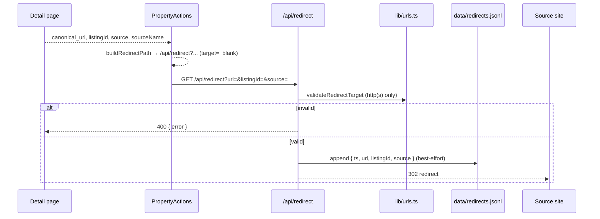

# Redirects and Leads

This is the money flow of Homes in the Sun: **discovery → outbound click to the source estate agent**, with **phase-gated lead capture** as the Phase-2 lever. The model is upstream referral, not trapping inventory on this domain (see `docs/mvp/commercials.md`).

## Business model (Phase 0 → 1)

- **Phase-1 primary**: traffic redirection / outbound clicks to marketing estate agents (PPC, affiliate, or informal referral deals once CTR is proven).
- **Phase-2**: formal lead-gen and/or supply-side subscriptions on **contracted** inventory (M2 feeds). Partner-forward of leads stays draft-first / escalate until Phase 2 is marked live in `docs/mvp/commercials.md`.
- **Secondary**: FX / currency partner links from country guides (affiliate); content SEO as a funnel.
- **Will not do in MVP**: sell leads against unlicensed fat-scraped catalogues, monetize deep links to Rightmove without a written deal, or claim partnerships that do not exist (enforced by the agent-ops policies in [Agent Ops](/openwiki/operations/agent-ops.md)).

## Outbound redirect flow

The primary CTA is rendered by `PropertyActions` (`components/PropertyActions.tsx`) on the detail page: "View full listing on Source listing" (label from `source_name`), which calls `buildRedirectPath` (`lib/urls.ts`) to build `/api/redirect?url=<canonical>&listingId=<id>&source=<source>`.



Design points:

- **Validation is a hard gate**: `validateRedirectTarget` allows only `http:`/`https:` (rejects `javascript:` etc.) — a security control, tested in `lib/canonical.test.ts`.
- **Click logging is best-effort**: on serverless the filesystem may be read-only; the redirect still happens even if the log append fails.
- **`data/redirects.jsonl`** is the Phase-1 metrics ledger (see `docs/mvp/metrics.md`) — replace with analytics/DB later.

## Lead capture flow

`LeadForm` (`components/LeadForm.tsx`) posts to `/api/leads`:

```mermaid
flowchart TD
    F[LeadForm: email, name?, message?, consent] --> POST[POST /api/leads]
    POST --> V{email valid? consent?}
    V -- no --> 400[400 { error }]
    V -- yes --> K{kind?}
    K -- waitlist --> S[store JSONL: waitlist]
    K -- request_intro --> R[store JSONL: request_intro, phase mvp-phase-0]
    R --> N[note: intent recorded, human review only]
    S --> OK[200 { ok: true, lead }]
    R --> OK
```

- **Waitlist**: autonomous to store (used on the homepage "Stay in the loop" section).
- **Request intro** (detail page): recorded only; the note field and the UI copy both say there is **no auto-forward to agents in this phase**. Partner email drafts go through Bob (draft-first) per `docs/agent-ops/policies/reply-and-leads.md`.
- Storage: `data/leads/leads.jsonl`; 503 if the environment cannot write (serverless read-only FS).

## Country guide panels (conversion context)

The detail page also renders `CountryGuidePanel` (`components/CountryGuidePanel.tsx`) keyed by `country_slug` via `getCountryGuide` (`lib/guides.ts`). It shows the first four guide sections, further-reading sources with attribution, and the standard disclaimer — giving foreign buyers decision context without republishing third-party guide content. Editorial standards live in `docs/mvp/country-guides.md`. The full guide page is `/guides/[country]`.

## Change guidance

- **Redirect target rules** live in `lib/urls.ts` — keep validation conservative; update `lib/canonical.test.ts` when changing them.
- **Lead gating** (`waitlist` vs `request_intro`) is a commercial/legal control: do not relax it without updating `docs/mvp/commercials.md` Phase-2 status and the reply-and-leads policy.
- **Metrics**: outbound CTR and lead counts are the Phase-1 commercial proof; `docs/mvp/unit-economics.md` sketches the targets (15–40% detail→agent CTR).
- The `homes-leads-inbox` Hermes job summarizes `data/leads/leads.jsonl`; the `homes-index-governance` job runs outbound link health checks (see [Agent Ops](/openwiki/operations/agent-ops.md)).
